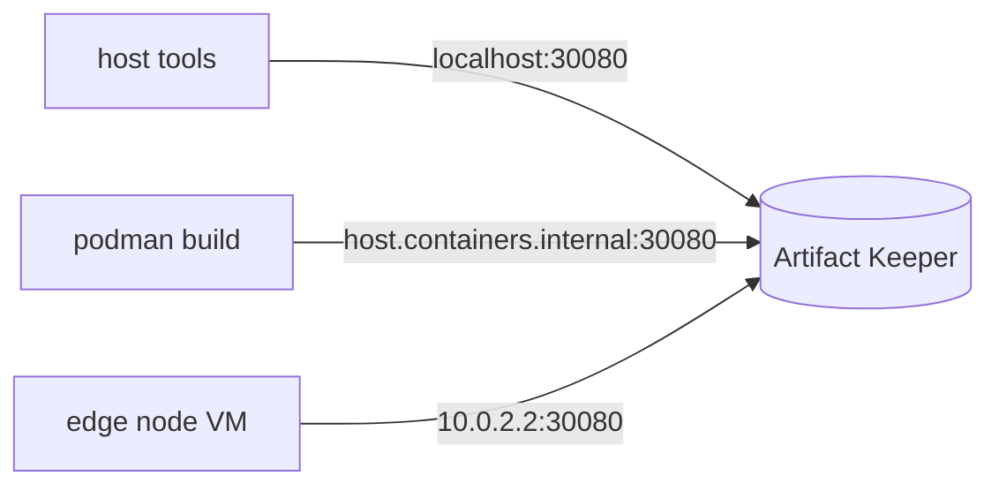
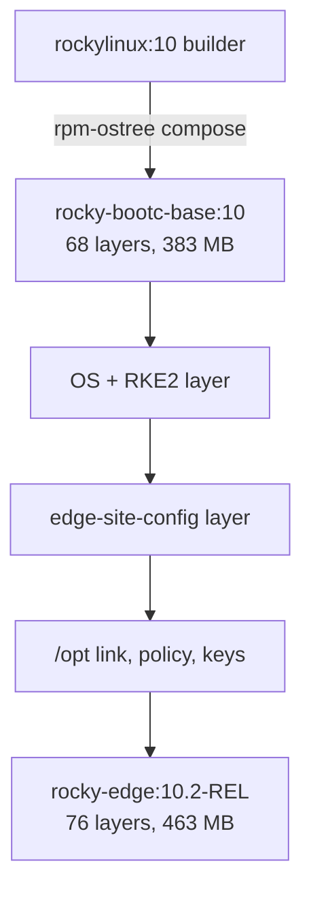
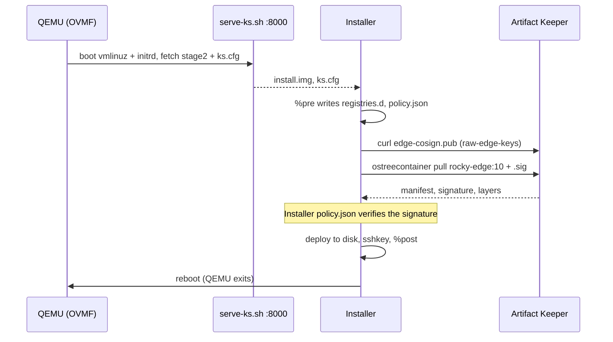
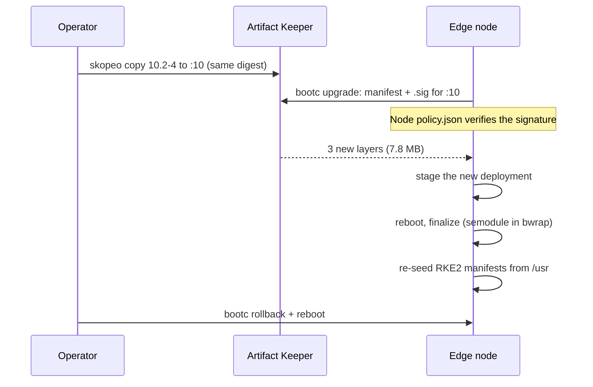

# Architecture

## Artifact Keeper repositories

`registry/bootstrap.sh` creates all of these on Artifact Keeper v1.10.2. Every repository is
created with `is_public: true`, so anonymous dnf, OCI and file reads work and edge nodes (a QEMU VM in this PoC) need
no credentials; writes need the CI token. A *proxy repository* (`remote` in the API) fetches
from an upstream on demand and caches; a *hosted* repository (`local` in the API) holds what
we upload.

| Repo ID | Format | Type | Upstream / content |
|---|---|---|---|
| `rpm-rocky10-baseos` | rpm | proxy | [Rocky 10 BaseOS](https://dl.rockylinux.org/pub/rocky/10/BaseOS/x86_64/os/) |
| `rpm-rocky10-appstream` | rpm | proxy | [Rocky 10 AppStream](https://dl.rockylinux.org/pub/rocky/10/AppStream/x86_64/os/) |
| `rpm-rocky10-extras` | rpm | proxy | [Rocky 10 extras](https://dl.rockylinux.org/pub/rocky/10/extras/x86_64/os/) |
| `rpm-epel10` | rpm | proxy | [EPEL 10](https://dl.fedoraproject.org/pub/epel/10/Everything/x86_64/) |
| `rpm-k3s` | rpm | proxy | [Rancher k3s el9](https://rpm.rancher.io/k3s/stable/common/centos/9/noarch/) (`k3s-selinux` only; kept for a k3s fallback) |
| `rpm-rke2-common` | rpm | proxy | [Rancher RKE2 common el10](https://rpm.rancher.io/rke2/stable/common/centos/10/noarch/) (`rke2-selinux`) |
| `rpm-rke2-1.36` | rpm | proxy | [Rancher RKE2 1.36 el10](https://rpm.rancher.io/rke2/stable/1.36/centos/10/x86_64/) (`rke2-server`, `-agent`, `-common`) |
| `rpm-edge-site` | rpm | hosted | our `edge-site-config` RPMs; repodata signed by Artifact Keeper |
| `oci-bootc` | docker | hosted | `rocky-bootc-base`, `rocky-edge`, and their cosign `.sig` tags |
| `oci-quay-proxy` | docker | proxy | [quay.io](https://quay.io) (the Rocky builder image) |
| `oci-dockerhub-proxy` | docker | proxy | [Docker Hub](https://registry-1.docker.io) (RKE2 system images and workloads) |
| `raw-edge-keys` | generic | hosted | public keys: cosign, our RPM key, Rancher, EPEL 10 |

The RKE2 minor is 1.36 because that was the `stable` channel (`v1.36.5+rke2r1`) on
2026-10-05, even though Rancher's `rke2/stable/` RPM tree also carries 1.37. Bumping means
adding another `rpm-rke2-<minor>` repository and keeping the old one for rollback.

## Two views of the same registry

The same registry has three addresses depending on who asks; signatures record the signer's
address, so the node's policy must name it explicitly.



| From | Address | Configured in |
|---|---|---|
| the host (skopeo, cosign, curl, `podman push`) | `localhost:30080` | `image/setup-host.sh` insecure drop-in, `signing/lib.sh` |
| a rootless podman container or `podman build` (pasta) | `host.containers.internal:30080` | `base/.work/ctx/ak-rocky.repo`, the edge image's build-time `.repo` file |
| the QEMU VM (slirp user networking) | `10.0.2.2:30080` | kickstart, the image's `/etc/yum.repos.d/edge.repo`, RKE2 `registries.yaml`, the node's `policy.json` |

`registry/out/edge.repo.in` carries `@HOST@` placeholders in both `baseurl=` and `gpgkey=`
lines and is rendered per view with `sed s/@HOST@/<host>/g`. The OCI token realm in
Artifact Keeper's `Www-Authenticate` header follows the request's `Host` header, so clients
in the VM are sent to `http://10.0.2.2:30080/v2/token`, which they can reach.

cosign records the signer's view of the repository (`localhost:30080/oci-bootc/rocky-edge`)
in the signature, while the node pulls `10.0.2.2:30080/oci-bootc/rocky-edge`. The node's
policy therefore uses `signedIdentity: exactRepository` naming the signer's view. With one DNS
name for the registry everywhere, a single `matchRepository` rule would do; see
[Adapting this to your environment](adapting.md#use-one-dns-name).

## Images, layers and tags



- **Base:** the RESF SIG/Containers recipe, built rootless from
  `oci-quay-proxy/rockylinux/rockylinux:10` with only the Artifact Keeper Rocky proxy
  repositories as dnf sources, `minimal` manifest. Rocky 10.2, kernel
  `6.12.0-211.61.1.el10_2`, bootc 1.16.4, 242 RPMs.
- **Edge image:** NetworkManager, openssh-server, bubblewrap, `kernel-modules-extra`,
  `rke2-server` and `rke2-selinux` in one `RUN`, the site RPM in a second `RUN`
  (`ARG SITE_RELEASE`), then `/opt -> var/opt`, kargs, tmpfiles, `policy.json`,
  `registries.d` and the cosign key. Because the first layer does not depend on the site
  release, a day-2 change is 2 to 3 new layers and about 7.7 MB compressed; the 68 base
  layers are shared byte for byte.
- **Fixes the base needed on a real node** (neither `podman build` nor
  `bootc container lint` catches them): `/opt` is a read-only directory in the RESF base, so
  RKE2's CNI installer cannot create `/opt/cni/bin`; and `bubblewrap` is missing, so
  `bootc upgrade` stages, fails to finalize at shutdown and the node boots the old image.
  See the [Findings overview](findings.md).

Tags read `rocky-edge:<Rocky minor>-<site-config release>`; `10.2-4` = Rocky 10.2 +
`edge-site-config-1.0-4`.

| Tag | Meaning |
|---|---|
| `rocky-bootc-base:10-YYYYMMDD` | immutable base build |
| `rocky-bootc-base:10` | floating base, what the edge image builds `FROM` |
| `rocky-bootc-base:unsigned` | same layers, Docker v2s2 manifest, new digest, not signed (negative test) |
| `rocky-edge:10.2-3` | signed baseline, `edge-site-config 1.0-3` |
| `rocky-edge:10.2-4` | signed day-2 release, `edge-site-config 1.0-4` |
| `rocky-edge:10` | floating tag the fleet tracks; moved by a registry-side `skopeo copy` |
| `rocky-edge:unsigned-test` | 10.2-4 plus a label, not signed (negative tests) |
| `rocky-edge:10.2-1`, `:10.2-2` | earlier unsigned builds from the lab notes; every policy now refuses them |
| `sha256-<digest>.sig` | cosign signature attachments, one per signed digest |

Promotion is a tag copy. The digest does not change, so the existing signature covers the
new tag and nothing is re-signed.

## Trust model

| Artifact | Signed by | Signature lives in | Verified by |
|---|---|---|---|
| `edge-site-config` RPM (1.0-3, 1.0-4) | our RPM GPG key, `rpmsign --addsign` in the build container | the RPM header | `rpm -K` at build time; dnf `gpgcheck=1` in the image build (and on the node if anyone runs dnf) |
| `rpm-edge-site` repodata | Artifact Keeper's own OpenPGP key for that repository (signing API, `sign_metadata`) | `repodata/repomd.xml.asc`, key at `repodata/repomd.xml.key` | dnf `repo_gpgcheck=1` |
| Proxied Rocky BaseOS / AppStream / extras, RKE2 common / 1.36 | the vendors | RPM headers and upstream `repomd.xml.asc`, passed through unchanged | dnf `gpgcheck=1` + `repo_gpgcheck=1` |
| Proxied EPEL 10, k3s (el9) | the vendors | RPM headers only (no upstream `repomd.xml.asc`) | dnf `gpgcheck=1` (`repo_gpgcheck=0`) |
| `rocky-bootc-base`, `rocky-edge` images | our cosign key, by digest, right after push | `oci-bootc`, tag `sha256-<digest>.sig` next to the image | `policy.json` on the build host, in the installer (kickstart `%pre`) and on the node (`bootc upgrade`) |
| Public keys: cosign, our RPM key, Rancher, EPEL 10 | n/a | hosted generic repository `raw-edge-keys` (anonymous read) | fetched by dnf (`gpgkey=`), kickstart `%pre` (`curl`), people |

Where the cosign key itself comes from, and what that trust rests on, is on
[What Artifact Keeper does here](artifact-keeper.md#root-of-trust).

### What `policy.json` does

`policy.json` (containers-policy.json) is read by containers-image, the library under
podman, skopeo, bootc and ostree-ext, and therefore under the `ostreecontainer` command of the installer (Anaconda).
It decides, per transport and per registry scope, whether a pulled image is accepted. A
`registries.d` entry with `use-sigstore-attachments: true` for the `oci-bootc` scope is the
other half: it tells containers-image to look for cosign's `sha256-<digest>.sig` tag. Three
copies matter here; the excerpts show `default` and the scopes under `transports.docker`, trimmed.

#### Build host

`~/.config/containers/policy.json`, written by `image/setup-host.sh` from a copy of the
system policy:

```json
{"localhost:30080/oci-bootc": [{
  "type": "sigstoreSigned",
  "keyPath": "<repo>/signing/keys/pub/edge-cosign.pub",
  "signedIdentity": {"type": "matchRepository"}
}]}
```

Effect: `podman build` `FROM` an unsigned base fails, and so does `skopeo copy` of an
unsigned image (which is why the day-2 negative test needs `--insecure-policy`).

#### Installer

`/etc/containers/policy.json` in the installer's environment, written by kickstart `%pre`
with the key fetched from `raw-edge-keys`:

```json
{"default": [{"type": "reject"}],
 "10.0.2.2:30080/oci-bootc/rocky-edge": [{
   "type": "sigstoreSigned",
   "keyPath": "/etc/pki/containers/edge-cosign.pub",
   "signedIdentity": {"type": "exactRepository",
                      "dockerRepository": "localhost:30080/oci-bootc/rocky-edge"}
 }]}
```

Effect: `ostreecontainer` refuses an unsigned image and the install aborts.

#### Node

`/etc/containers/policy.json` shipped in the image (`image/rootfs/`):

```json
{"default": [{"type": "reject"}],
 "10.0.2.2:30080/oci-bootc/rocky-edge":       [{"type": "sigstoreSigned", "...": "as above"}],
 "10.0.2.2:30080/oci-bootc/rocky-bootc-base": [{"type": "sigstoreSigned", "...": "as above"}],
 "10.0.2.2:30080/oci-bootc":                  [{"type": "reject"}]}
```

Effect: `bootc upgrade` refuses an unsigned image and nothing is staged; anything else under
`oci-bootc` is rejected outright.

Two details took measurement to establish:

- **The identity rule.** cosign writes a tag-less identity. The default
  `matchRepoDigestOrExact` rejects it (`Signature for identity ... is not accepted`) for
  tag and digest references alike; `matchRepository` and `exactRepository` accept it.
- **The policy is the control, not the kickstart flag.** On Rocky 10.2 an unsigned image is
  refused with our policy even when `--no-signature-verification` is added back, and is
  installed with the installer's stock `insecureAcceptAnything` policy even without the flag.
  See the [signing log](findings-signing.md#7-kickstart).

RKE2's containerd does not read `policy.json`, so workload images are unaffected.

## Kickstart flow



- **Install media.** No ISO: the Rocky 10.2 pxeboot `vmlinuz` and `initrd.img` plus
  `inst.stage2` pointing at a locally cached `install.img`, which is how a PXE/iPXE install
  server would boot real hardware.
- **`ostreecontainer`, not `bootc`.** The newer `bootc` kickstart command on Rocky 10.2 leaves
  root's `authorized_keys` and `/etc/resolv.conf` with the wrong SELinux labels, so sshd and
  NetworkManager hit AVC denials on first boot.
  `ostreecontainer --url=10.0.2.2:30080/oci-bootc/rocky-edge:10 --transport=registry`
  labels correctly. Evidence in the
  [deploy log](findings-deploy.md#install-method-ostreecontainer-vs-the-bootc-kickstart-command).
- **`%pre --erroronfail`** writes the installer's insecure-registry drop-in, the
  `registries.d` entry and `policy.json`, and fetches the cosign key from Artifact Keeper.
- **Access.** `rootpw --lock` and `sshkey --username=root` with the operator's
  `~/.ssh/id_ed25519.pub`.
- **`%post`** writes the same three files into the installed system only if the image lacks
  them (it never does). Writing a different copy would make them locally modified `/etc`
  files that a later image, for example one with a rotated key, could no longer update
  through ostree's 3-way `/etc` merge.

## Day-2 flow



- The fleet tracks the floating tag `rocky-edge:10`. Releasing is moving the tag in the
  registry; nodes pick it up with `bootc upgrade` (there is no automatic update timer,
  because the base is built from the `minimal` manifest).
- Site configuration lives in `/usr` (the RPM ships manifests under
  `/usr/share/edge-site/manifests`), and `edge-site-manifests.service` copies them into
  `/var/lib/rancher/rke2/server/manifests` on every boot. `/var` is not touched by
  `bootc upgrade`, so this is what makes both upgrade and rollback change the workload too.
- An unsigned `:10` is refused before anything is staged:
  `A signature was required, but no signature exists`.
- `bootc rollback` swaps the booted and rollback deployments; running it twice swaps back.
- The build-host policy also fires on this path: the operator's `skopeo copy` reads the
  source through it, so promoting an unsigned image already fails on the build host.
