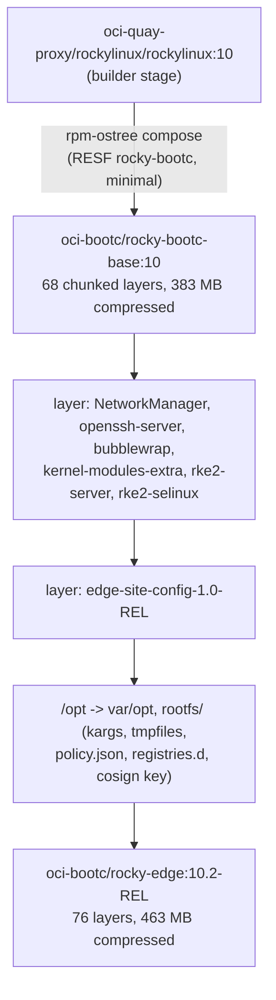
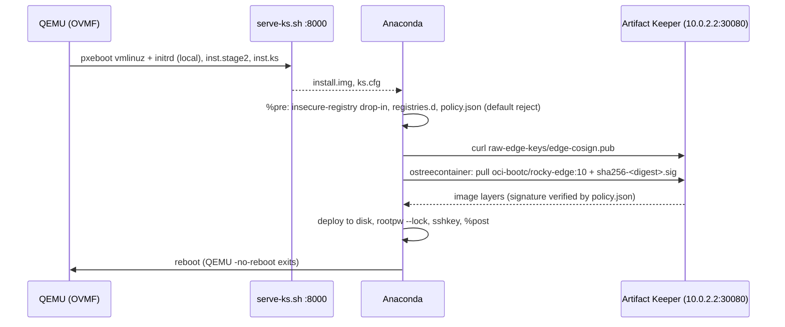
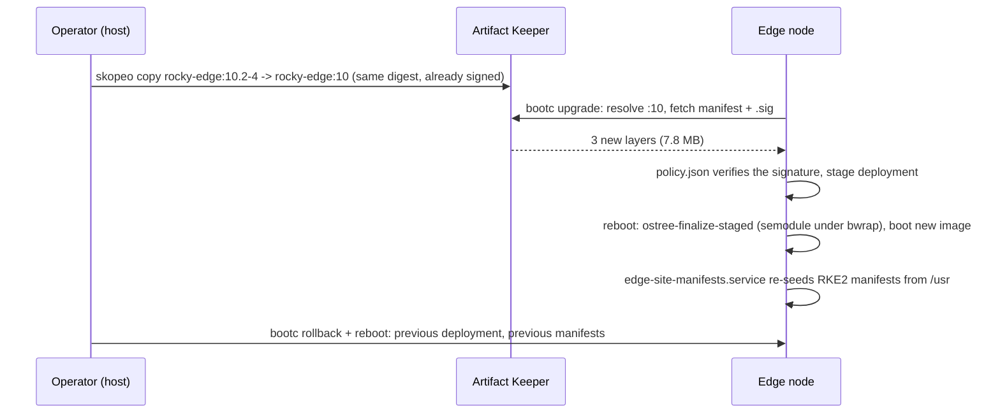

# Architecture

## Artifact Keeper repositories

`registry/bootstrap.sh` creates all of these on Artifact Keeper v1.10.2. Every repo is
created with `is_public: true`, so anonymous dnf, OCI and file reads work and edge nodes need
no credentials; writes need the CI token.

| Key | Format | Type | Upstream / content |
|---|---|---|---|
| `rpm-rocky10-baseos` | rpm | remote | `https://dl.rockylinux.org/pub/rocky/10/BaseOS/x86_64/os/` |
| `rpm-rocky10-appstream` | rpm | remote | `https://dl.rockylinux.org/pub/rocky/10/AppStream/x86_64/os/` |
| `rpm-rocky10-extras` | rpm | remote | `https://dl.rockylinux.org/pub/rocky/10/extras/x86_64/os/` |
| `rpm-epel10` | rpm | remote | `https://dl.fedoraproject.org/pub/epel/10/Everything/x86_64/` |
| `rpm-k3s` | rpm | remote | `https://rpm.rancher.io/k3s/stable/common/centos/9/noarch/` (only `k3s-selinux`, el9; kept for the k3s fallback) |
| `rpm-rke2-common` | rpm | remote | `https://rpm.rancher.io/rke2/stable/common/centos/10/noarch/` (`rke2-selinux`) |
| `rpm-rke2-1.36` | rpm | remote | `https://rpm.rancher.io/rke2/stable/1.36/centos/10/x86_64/` (`rke2-server`, `-agent`, `-common`) |
| `rpm-edge-site` | rpm | local (hosted) | our `edge-site-config` RPMs; repodata signed by Artifact Keeper |
| `oci-bootc` | docker | local (hosted) | `rocky-bootc-base`, `rocky-edge`, and their cosign `sha256-<digest>.sig` tags |
| `oci-quay-proxy` | docker | remote | `https://quay.io` (the Rocky builder image) |
| `oci-dockerhub-proxy` | docker | remote | `https://registry-1.docker.io` (RKE2 system images and workloads) |
| `raw-edge-keys` | generic | local (hosted) | public keys: `edge-cosign.pub`, `RPM-GPG-KEY-edge`, `RPM-GPG-KEY-Rancher`, `RPM-GPG-KEY-EPEL-10` |

The RKE2 minor is 1.36 because that was the `stable` channel
(`https://update.rke2.io/v1-release/channels`: `v1.36.5+rke2r1`) on 2026-10-05, even though
Rancher's `rke2/stable/` RPM tree also carries 1.37. Bumping means adding another
`rpm-rke2-<minor>` repo and keeping the old one for rollback.

## Two views of the same registry

Artifact Keeper listens on the host at `:30080` (plain HTTP, Caddy in front). Each consumer
reaches it under a different name:

| From | Address | Configured in |
|---|---|---|
| the host (skopeo, cosign, curl, `podman push`) | `localhost:30080` | `image/setup-host.sh` insecure drop-in, `signing/lib.sh` |
| a rootless podman container or `podman build` (pasta) | `host.containers.internal:30080` | `base/.work/ctx/ak-rocky.repo`, the edge image's build-time `build.repo` |
| the QEMU VM (slirp user networking) | `10.0.2.2:30080` | kickstart, the image's `/etc/yum.repos.d/edge.repo`, RKE2 `registries.yaml`, the node's `policy.json` |

`registry/out/edge.repo.in` carries `@HOST@` placeholders in both `baseurl=` and `gpgkey=`
lines and is rendered per view with `sed s/@HOST@/<host>/g`. The OCI token realm in
Artifact Keeper's `Www-Authenticate` header follows the request's `Host` header, so clients
in the VM are sent to `http://10.0.2.2:30080/v2/token`, which they can reach.

The split has one consequence for signatures: cosign records the signer's view of the
repository (`localhost:30080/oci-bootc/rocky-edge`) in the signature, while the node pulls
`10.0.2.2:30080/oci-bootc/rocky-edge`. The node's policy therefore uses
`signedIdentity: exactRepository` naming the signer's view. With one DNS name for the
registry everywhere, a single `matchRepository` rule would do.

## Images, layers and tags

- **Base:** the RESF SIG/Containers recipe, built rootless with only the Artifact Keeper
  Rocky proxies as dnf sources. Rocky 10.2, kernel `6.12.0-211.61.1.el10_2`, bootc 1.16.4,
  242 RPMs.
- **Edge image:** OS additions and RKE2 in one `RUN`, the site RPM in a second `RUN`
  (`ARG SITE_RELEASE`). Because the first layer does not depend on the site release, a
  day-2 change is 2 to 3 new layers and about 7.7 MB compressed; the 68 base layers are
  shared byte for byte.
- **Fixes the base needed on a real node** (neither `podman build` nor
  `bootc container lint` catches them): `/opt` is a read-only directory in the RESF base, so
  RKE2's CNI installer cannot create `/opt/cni/bin`; and `bubblewrap` is missing, so
  `bootc upgrade` stages, fails to finalize at shutdown and the node boots the old image.
  See [Findings: image](findings-image.md#5-opt-is-read-only-in-the-resf-base-which-breaks-rke2s-cni-found-at-the-vm-gate).

| Tag | Meaning |
|---|---|
| `rocky-bootc-base:10-YYYYMMDD` | immutable base build |
| `rocky-bootc-base:10` | floating base, what the edge image builds FROM |
| `rocky-bootc-base:unsigned` | same layers, Docker v2s2 manifest, new digest, not signed (negative test) |
| `rocky-edge:10.2-3` | signed baseline, `edge-site-config 1.0-3` |
| `rocky-edge:10.2-4` | signed day-2 release, `edge-site-config 1.0-4` |
| `rocky-edge:10` | floating tag the fleet tracks; moved by a registry-side `skopeo copy` |
| `rocky-edge:unsigned-test` | 10.2-4 plus a label, not signed (negative tests) |
| `rocky-edge:10.2-1`, `:10.2-2` | iteration 1, unsigned; the policies now refuse them |
| `sha256-<digest>.sig` | cosign signature attachments, one per signed digest |

Promotion is a tag copy. The digest does not change, so the existing signature covers the
new tag and nothing is re-signed.

## Trust model

From the iteration 2 section of the [plan](PLAN.md#iteration-2-2026-10-06-sign-everything-verify-everywhere):

| Artifact | Signed by | Signature lives in | Verified by |
|---|---|---|---|
| `edge-site-config` RPM | our GPG key (`rpmsign` in the build container) | the RPM header | dnf `gpgcheck=1` in the image build |
| `rpm-edge-site` repodata | Artifact Keeper managed GPG key (`sign_metadata`) | `repodata/repomd.xml.asc` | dnf `repo_gpgcheck=1` |
| Proxied Rocky / RKE2 RPMs | upstream vendors | RPM headers (pass through the proxy) | dnf `gpgcheck=1` with vendor keys |
| `rocky-bootc-base`, `rocky-edge` images | our cosign key, by digest, after push | `oci-bootc` (`sha256-<digest>.sig` tag / referrers) | podman `policy.json` on the build host; Anaconda via `%pre` policy; `bootc upgrade` via policy baked into the image |
| Public keys (cosign, RPM GPG, Rancher) | n/a | Artifact Keeper hosted raw/generic repo `raw-edge-keys` | fetched by build, kickstart `%pre`, and shipped in the RPM |

The proxied Rocky and RKE2 repos also pass upstream's `repomd.xml.asc` through byte for
byte, so they run with `repo_gpgcheck=1` too. EPEL 10 and Rancher's k3s tree publish no
repomd signature, so those two have `repo_gpgcheck=0` but still `gpgcheck=1`.

### What `policy.json` does

`containers-policy.json` is read by containers-image, the library under podman, skopeo,
bootc and ostree-ext (and therefore Anaconda's `ostreecontainer`). It decides, per transport
and per registry scope, whether a pulled image is accepted. Three copies of it matter here:

| Where | Default | Rule for our images | Effect |
|---|---|---|---|
| Build host, `~/.config/containers/policy.json` (`image/setup-host.sh`) | the system policy's | `localhost:30080/oci-bootc`: `sigstoreSigned`, key `signing/keys/pub/edge-cosign.pub`, `signedIdentity: matchRepository` | `podman build FROM` an unsigned base fails |
| Installer, written by kickstart `%pre` | `reject` | `10.0.2.2:30080/oci-bootc/rocky-edge`: `sigstoreSigned`, key fetched from `raw-edge-keys`, `signedIdentity: exactRepository localhost:30080/oci-bootc/rocky-edge` | Anaconda refuses an unsigned image |
| Node, `/etc/containers/policy.json` in the image | `reject` | same as the installer, for `rocky-edge` and `rocky-bootc-base`; everything else under `10.0.2.2:30080/oci-bootc` rejected | `bootc upgrade` refuses an unsigned image, nothing is staged |

A `registries.d` entry with `use-sigstore-attachments: true` for the `oci-bootc` scope is the
other half: it tells containers-image to look for cosign's `sha256-<digest>.sig` tag.

Two details took measurement to establish:

- **The identity rule.** cosign writes a tag-less identity. The default
  `matchRepoDigestOrExact` rejects it (`Signature for identity ... is not accepted`) for
  tag and digest references alike; `matchRepository` and `exactRepository` accept it.
- **The policy is the control, not the kickstart flag.** On Rocky 10.2 an unsigned image is
  refused with our policy even when `--no-signature-verification` is added back, and is
  installed with the installer's stock `insecureAcceptAnything` policy even without the flag.
  See [Findings: signing](findings-signing.md#7-kickstart).

RKE2's containerd does not read `policy.json`, so workload images are unaffected.

## Kickstart flow

- **Install media.** No ISO: the Rocky 10.2 pxeboot `vmlinuz` and `initrd.img` plus
  `inst.stage2` pointing at a locally cached `install.img`, which is how a PXE/iPXE install
  server would boot real hardware.
- **`ostreecontainer`, not `bootc`.** The newer `bootc` kickstart command on Rocky 10.2 leaves
  `/root/.ssh` and `/etc/resolv.conf` with the wrong SELinux labels, so sshd and
  NetworkManager hit AVC denials on first boot. `ostreecontainer --url=10.0.2.2:30080/oci-bootc/rocky-edge:10 --transport=registry` labels correctly.
- **`%pre --erroronfail`** writes the installer's insecure-registry drop-in, the
  `registries.d` entry and `policy.json`, and fetches the cosign key from Artifact Keeper.
- **Access.** `rootpw --lock` and `sshkey --username=root` with the operator's public key.
- **`%post`** writes the same three files into the installed system only if the image lacks
  them (it never does). Writing a different copy would make them locally modified `/etc`
  files that a later image, for example one with a rotated key, could no longer update
  through ostree's 3-way `/etc` merge.

## Day-2 flow

- The fleet tracks the floating tag `rocky-edge:10`. Releasing is moving the tag in the
  registry; nodes pick it up with `bootc upgrade` (there is no automatic update timer,
  because the base is built from the `minimal` manifest).
- Site configuration lives in `/usr` (the RPM ships manifests under
  `/usr/share/edge-site/manifests`), and `edge-site-manifests.service` copies them into
  `/var/lib/rancher/rke2/server/manifests` on every boot. `/var` is not touched by
  `bootc upgrade`, so this is what makes both upgrade and rollback change the workload too.
- An unsigned `:10` is refused before anything is staged:
  `A signature was required, but no signature exists`.
- `bootc rollback` swaps the booted and rollback deployments; running it twice swaps back.
