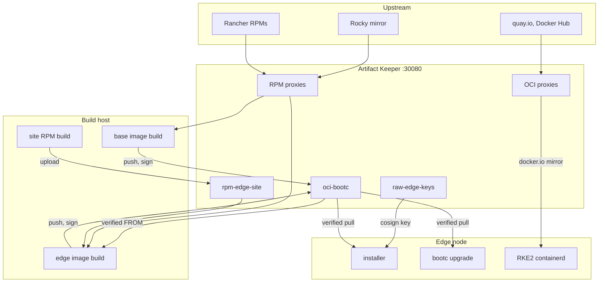

# Rocky Linux image mode on bare metal, with Artifact Keeper as the source of truth

This repository is a working proof of concept for running Rocky Linux 10 edge nodes in
**image mode**: the operating system is delivered as a bootc container image, installed and
updated by ostree, instead of being assembled package by package on each machine. One
[Artifact Keeper](https://github.com/artifact-keeper/artifact-keeper) instance holds
everything a node boots from: the Rocky and RKE2 RPMs, our own site-configuration RPM, the
bootc images and the public keys. An edge node (a QEMU VM in this PoC) installs from it with
the stock Rocky installer and a kickstart, comes up running RKE2, and is upgraded and rolled
back with `bootc` against the same registry. Every RPM, repo index and image is signed, and
the build host, the installer and the node each refuse anything unsigned.

!!! info "Read the blog post"
    The write-up behind this repository is on the OpenTeams engineering blog:
    [Rocky Linux Image Mode on Bare Metal, with Artifact Keeper as the Source of Truth](https://openteams.com/rocky-linux-image-mode-artifact-keeper/).
    More posts: <https://openteams.com/engineering-blog/>.

## Start here

-   **Run it yourself**

    ---

    [Environment setup](environment.md), then the [Walkthrough](walkthrough.md).
    About 3 minutes from power-on to a working cluster with KVM, about 17 minutes without.

-   **Understand the design and Artifact Keeper's role**

    ---

    [Architecture](architecture.md), then
    [What Artifact Keeper does here](artifact-keeper.md).

-   **Hit the same error**

    ---

    [Troubleshooting](troubleshooting.md) (one section per error string), then the
    [Findings overview](findings.md).

## One registry, every consumer

The repositories behind each box, their upstreams and the three addresses the registry has
are on the [Architecture](architecture.md) page. The step-by-step pipeline is at the top of
the [Walkthrough](walkthrough.md).

Source: [github.com/brandonrc/rocky-custom-baremetal-deployment](https://github.com/brandonrc/rocky-custom-baremetal-deployment).
Each top-level directory there (`registry/`, `signing/`, `base/`, `rpms/`, `image/`, `deploy/`)
has a README with the directory-specific details.
