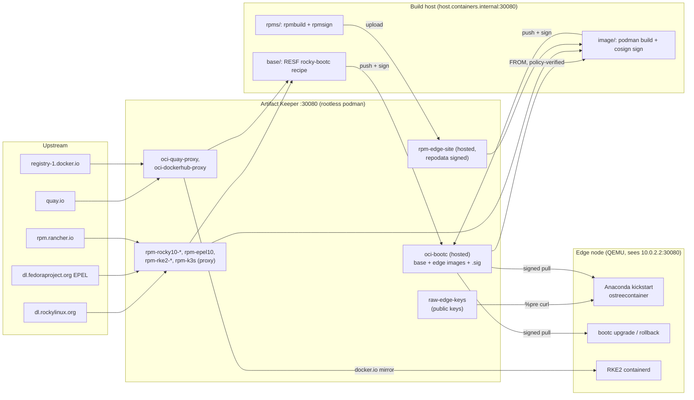

# Rocky Linux image mode on bare metal, with Artifact Keeper as the source of truth

This repository is a working proof of concept: one
[Artifact Keeper](https://github.com/artifact-keeper/artifact-keeper) instance holds
everything a Rocky Linux 10 edge node boots from, and a "bare-metal" node (a QEMU VM)
installs from it with the stock Rocky installer and a kickstart, comes up running RKE2,
and is upgraded and rolled back with `bootc` against the same registry.

Iteration 2 signs everything and verifies everywhere. Our RPMs are GPG-signed, Artifact
Keeper signs our repo metadata, vendor signatures pass through the proxies, and every
image is cosign-signed by digest. dnf runs with `gpgcheck=1` (plus `repo_gpgcheck=1`
where the metadata is signed), and podman on the build host, Anaconda and `bootc upgrade`
on the node all refuse unsigned images through `containers-policy.json`.

!!! info "Read the blog post"
    The write-up behind this repository is on the OpenTeams engineering blog:
    [Rocky Linux Image Mode on Bare Metal, with Artifact Keeper as the Source of Truth](https://openteams.com/blog/rocky-image-mode-artifact-keeper).
    If that link is not live yet, the blog index is at <https://openteams.com/blog>.

## What is in the registry

| Artifact | Artifact Keeper repo | Repo type |
|---|---|---|
| Rocky 10 BaseOS / AppStream / extras | `rpm-rocky10-*` | RPM, remote proxy |
| EPEL 10 | `rpm-epel10` | RPM, remote proxy |
| RKE2 (Kubernetes) RPMs | `rpm-rke2-common`, `rpm-rke2-1.36` | RPM, remote proxy |
| Our site-config RPM | `rpm-edge-site` | RPM, hosted (repodata signed by Artifact Keeper) |
| Rocky bootc base image (self-built) and the edge image | `oci-bootc` | OCI, hosted (plus cosign `.sig` tags) |
| Upstream container images (quay.io, Docker Hub) | `oci-quay-proxy`, `oci-dockerhub-proxy` | OCI, remote proxy |
| Public keys (cosign, RPM GPG, vendor) | `raw-edge-keys` | generic, hosted, anonymous read |

The full list of 12 repositories is on the [Architecture](architecture.md#artifact-keeper-repositories) page.

## One registry, every consumer



## The pipeline

```text
registry-up -> keys -> publish-keys -> base -> rpm -> image/push -> unsigned-test -> verify
            -> vm-install -> vm-boot -> vm-verify -> vm-upgrade-unsigned -> vm-upgrade -> vm-rollback
```

1. **Registry.** Artifact Keeper v1.10.2 runs under rootless podman compose. An idempotent
   bootstrap creates the repositories, turns on repodata signing for `rpm-edge-site`, and
   mints a CI token.
2. **Keys.** A cosign key pair and an RPM GPG key are generated locally; the public halves
   and the vendor keys are published to `raw-edge-keys`.
3. **Base image.** The RESF SIG/Containers `rocky-bootc` recipe is built rootless with dnf
   pointed only at the Artifact Keeper proxies, pushed to `oci-bootc/rocky-bootc-base:10`
   and cosign-signed (Rocky publishes no official bootc image).
4. **Site RPM.** `edge-site-config` (RKE2 config, registry mirror, MOTD, a demo manifest) is
   built and `rpmsign`ed in a Rocky container and uploaded to `rpm-edge-site`.
5. **Edge image.** `oci-bootc/rocky-edge:10.2-<rel>` layers RKE2 and the site RPM on the
   base, ships the node's signature policy, and fails its own build on any repo URL that is
   not Artifact Keeper or any `gpgcheck=0`.
6. **Install.** The QEMU node netboots the stock Rocky 10.2 installer; the kickstart writes a
   signature policy in `%pre` and installs the edge image with `ostreecontainer`.
7. **Day 2.** Retag `:10` to the next release in the registry, `bootc upgrade`, reboot;
   `bootc rollback` returns to the previous image. Unsigned images are refused at every step.

## Where to go next

| Page | What it covers |
|---|---|
| [Setting up the environment](environment.md) | Host requirements, KVM vs TCG, rootless podman, the user-level files the scripts write, ports |
| [Walkthrough](walkthrough.md) | Every `make` target in order, what it does and what output to expect, including the negative tests |
| [Architecture](architecture.md) | Repositories, the two views of the registry, image layering and tags, the trust model, kickstart and day-2 flow |
| [Artifact Keeper notes](artifact-keeper-notes.md) | What we learned about Artifact Keeper v1.10.2: docs vs reality, API calls, signing, proxies, gotchas |
| [Timings](timings.md) | Final KVM numbers and the earlier software-emulation (TCG) run |
| [Plan](PLAN.md) | The original design and the iteration 2 trust table, verbatim |
| [Findings: image](findings-image.md) | Base and edge image: what broke and why (read-only `/opt`, missing `bubblewrap`, lint) |
| [Findings: deploy](findings-deploy.md) | Kickstart to running cluster to day 2, run by run, under TCG |
| [Findings: signing](findings-signing.md) | Iteration 2: keys, RPM and repodata signing, cosign formats, policies, KVM timings |

Source: [github.com/brandonrc/rocky-custom-baremetal-deployment](https://github.com/brandonrc/rocky-custom-baremetal-deployment).
Each top-level directory there (`registry/`, `signing/`, `base/`, `rpms/`, `image/`, `deploy/`)
has its own README with the details and the deviations from upstream docs.
